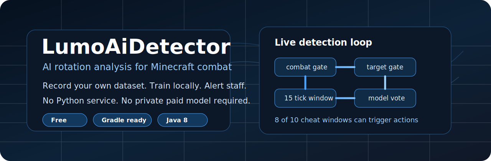
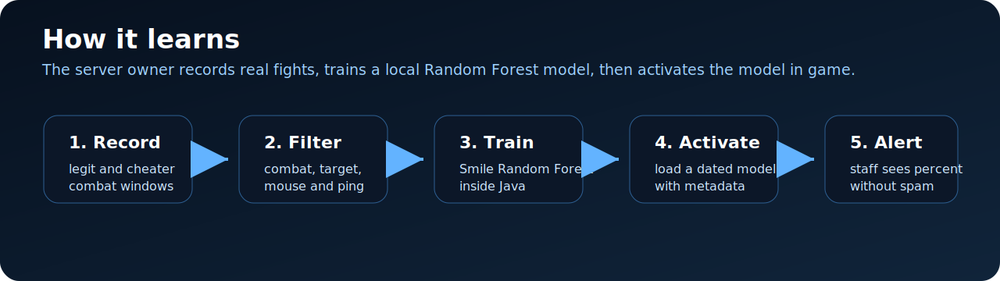
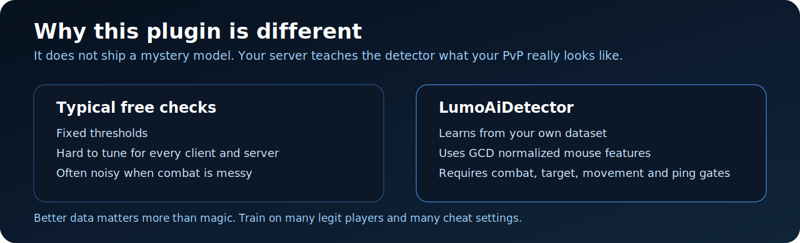

<p align="center">
  
</p>

<p align="center">
  <a href="https://github.com/isLumo/LumoAiDetector/actions/workflows/gradle.yml"></a>
  <a href="https://github.com/isLumo/LumoAiDetector/releases"></a>
  <a href="https://github.com/isLumo/LumoAiDetector/blob/main/LICENSE"></a>
  
  
  
</p>

<p align="center">
  <a href="#install">Install</a>
  ·
  <a href="#commands">Commands</a>
  ·
  <a href="#training-your-own-model">Training</a>
  ·
  <a href="#configuration">Config</a>
  ·
  <a href="#changelog">Changelog</a>
  ·
  <a href="#license-and-forks">License</a>
</p>

# LumoAiDetector

LumoAiDetector is a free Minecraft anti-cheat that trains a local AI model inside the server. It records combat rotation windows, filters out bad data, trains a Smile Random Forest model in Java, and alerts staff when a player looks suspicious.

I originally built this for my own server. After working on it for a while, I decided to publish it. As of June 2026, there are free anti-cheats and a few ML experiments out there, but I could not find a plugin that does this exact workflow: record your own dataset, train a local model, manage model files in game, and keep every message editable.

The plugin is free so server owners can test this without paying for a closed model or running a separate Python service. I am not shipping a pre-trained model. Train yours. Better data means a better detector.

<p align="center">
  
</p>

## What it does

LumoAiDetector watches combat rotations, not random movement. A window reaches the model only when all gates pass:

- The player recently attacked or swung their hand.
- A living target is nearby and inside the player's aim area.
- The mouse moved enough across the 15 tick window.
- Tick timing stayed inside the configured network range.

Each valid window becomes 120 numeric features:

```text
15 ticks * 8 values = dx, dy, dt, v, a, j, err, derr
```

The class label is simple:

```text
0 = legit
1 = cheater
```

<p align="center">
  
</p>

## Why train your own model

Different servers have different players, clients, ping patterns, arenas, mobs, PvP styles, and cheat settings. A model trained on one small private setup can look impressive in a demo and still be useless on your server.

Train on boring normal fights. Train on cracked aim settings. Train on smooth aim settings. Train on bad players, good players, high sensitivity, low sensitivity, different DPI, different weapons, jumping, strafing, panic flicks, and missed hits. The model gets smarter when the dataset stops being too clean.

If you only record one legit player and one cheat profile, you are teaching the model a tiny story. Give it many stories.

## Features

- Gradle project ready for IntelliJ IDEA.
- Bukkit, Spigot, Paper, Purpur and Folia compatible.
- Java 8 bytecode target.
- No NMS or ProtocolLib needed.
- Configurable `plugins/LumoAiDetector/config.yml`.
- Configurable `plugins/LumoAiDetector/messages.yml`.
- Admin command `/lad`.
- Dataset recording for legit and cheater samples.
- CSV window format with 15 ticks and 120 features.
- Anti garbage gates for combat, target, movement and ping.
- Async model training with Smile Random Forest.
- Dated model files with metadata.
- Model activation and deactivation in game.
- Temporary model backups after delete.
- Staff alerts above the configured suspicion percent.
- Permission based tab complete.
- Auto punishment support is present, but disabled by default.
- SHA-256 model integrity verification on load.
- F1-score in training metrics.
- Alert history per player.
- Bypass permission (LumoAiDetector.bypass) for staff and trusted players.
- Per-world detection disable via disabled-worlds config.
- UUID whitelist in config for exempting specific players.
- Player notification on punishment trigger.
- /lad dataset trim <rows> to shrink the dataset in game.
- Extended punishment placeholders: {world}, {ping}.
- Async prediction mode for high-population servers.

## Install

1. Build the jar.
2. Put `build/libs/LumoAiDetector-0.1.1.jar` into your server `plugins` folder.
3. Start the server once.
4. Edit `plugins/LumoAiDetector/config.yml` only if you know what you want to tune.
5. Edit `plugins/LumoAiDetector/messages.yml` if you want different text.

Pre-built jars are available on the [Releases](https://github.com/isLumo/LumoAiDetector/releases) page.

## Build

### Linux / macOS

```bash
chmod +x build.sh && ./build.sh
```

### Windows

```powershell
.\build.ps1
```

### IntelliJ IDEA

Open the folder as a Gradle project:

```text
File -> Open -> LumoAiDetector
```

Then run:

```text
Gradle -> Tasks -> shadow -> shadowJar
```

The plugin jar will be here:

```text
build/libs/LumoAiDetector-0.1.1.jar
```

Console build:

```powershell
gradle clean shadowJar
```

## Commands

### Recording

| Command | Description |
|---|---|
| `/lad record legit <player>` | Start recording legit data. |
| `/lad record cheater <player>` | Start recording cheater data. |
| `/lad record stop <player>` | Stop recording a specific player. |
| `/lad record stop all` | Stop all active recordings immediately. |
| `/lad record info [all\|legit\|cheater] [page]` | List active recordings with stop buttons. |

### Models

| Command | Description |
|---|---|
| `/lad train` | Train a model on the current dataset. |
| `/lad active <model>` | Load and activate a model. |
| `/lad deactivate` | Disable the active model. |
| `/lad models [page]` | List trained models with active/delete buttons. |
| `/lad models info <model>` | Show detailed model metrics (accuracy, precision, recall, F1). |
| `/lad delete <model>` | Move a model to temporary backup. |

### Backups

| Command | Description |
|---|---|
| `/lad backup list [page]` | List model backups with restore/purge buttons. |
| `/lad backup restore <backup>` | Restore a model from backup. |
| `/lad backup purge <backup>` | Permanently delete a backup. |

### Checks and status

| Command | Description |
|---|---|
| `/lad check <player>` | Check current suspicion percentage for a player. |
| `/lad check <player> history` | View recent alert history for a player. |
| `/lad status` | Show plugin, detector, model, dataset and recording status. |
| `/lad dataset info` | Show dataset row count, class balance and file size. |
| `/lad dataset trim <rows>` | Keep only the last N rows and delete the rest. |

### Other

| Command | Description |
|---|---|
| `/lad reload` | Reload configs and messages. |
| `/lad help` | Show all available commands. |

## Permissions

```text
LumoAiDetector.admin        - Bypass all permission checks.
LumoAiDetector.reload       - /lad reload
LumoAiDetector.status       - /lad status, /lad dataset info
LumoAiDetector.record       - /lad record
LumoAiDetector.train        - /lad train
LumoAiDetector.active       - /lad active, /lad deactivate
LumoAiDetector.check        - /lad check
LumoAiDetector.models       - /lad models, /lad models info
LumoAiDetector.delete       - /lad delete
LumoAiDetector.backup       - /lad backup
LumoAiDetector.alert        - Receive alert messages.
LumoAiDetector.bypass       - Completely exempt a player from detection.
```

## Training your own model

Start with a local test server. Spawn a zombie, use a bot, or fight another account.

Record legit data:

```text
/lad record legit <yourName>
```

Play normally. Move around. Jump. Flick. Track targets smoothly. Miss sometimes. Change sensitivity and DPI during the session. Record several types of normal play, not only your best aim.

Record cheater data:

```text
/lad record cheater <yourName>
```

Test different cheat profiles. Fast aim, slow smoothing, obvious Killaura, subtle rotations, weird settings, and anything you expect real cheaters to use.

Train:

```text
/lad train
```

Activate:

```text
/lad active <model>
```

The plugin names models by date and time. Metadata is saved next to every model, so you can see training time, dataset size, accuracy, precision, recall, F1 and more.

## Configuration

The default config is conservative. Alerts are enabled. Auto punishment is disabled. This is intentional.

Do not enable punishments until you have trained and tested your own model. A model is only as good as its data.

Main files:

```text
plugins/LumoAiDetector/config.yml
plugins/LumoAiDetector/messages.yml
plugins/LumoAiDetector/data/dataset.csv
plugins/LumoAiDetector/models/
plugins/LumoAiDetector/backups/models/
plugins/LumoAiDetector/stats.yml
plugins/LumoAiDetector/runtime.yml
```

## Changelog

### 0.1.1 (planned)

- Fixed memory leak: alert history is now cleared when a player disconnects.
- Fixed hardcoded English text in /lad dataset info (now uses messages.yml).
- Fixed IO executor not waiting for pending writes on shutdown.
- Fixed pruneStatesIfNeeded running on every PlayerMoveEvent; now throttled to once per 5s.
- Fixed path traversal: Windows drive-letter paths in dataset-path config are now rejected.
- Fixed saveModel writing metadata file twice; SHA-256 is computed before the first write.
- Optimized DatasetCsv.row() by replacing String.format with ThreadLocal DecimalFormat.
- Added LumoAiDetector.bypass permission to exclude players from detection.
- Added detector.disabled-worlds config list.
- Added detector.whitelisted-uuids config list.
- Added punishment.notify-player and punishment.notify-player-message config.
- Added /lad dataset trim <rows> command.
- Added {world} and {ping} placeholders for punishment commands.
- Added performance.async-prediction config option.
- Improved target() to skip entities outside the sphere radius.

### 0.1.0 (2026-06-02)

Major stabilization release. See the [full changelog](https://github.com/isLumo/LumoAiDetector/releases/tag/v0.1.0).

Key changes:
- Async IO for model loading and dataset snapshots - no more main thread freezes.
- Fixed race conditions in player state maps and thread safety in formatting.
- Optimized dataset writing with a cached buffered writer and row limits.
- SHA-256 verification when loading models to detect tampering.
- Renamed `/lad deactive` to `/lad deactivate` and `/lad deleted` to `/lad delete` with backward-compatible aliases.
- New commands: `/lad record stop all`, `/lad dataset info`, `/lad models info`, `/lad check history`.
- F1-score is now computed and displayed after training.
- Separate training executor prevents progress messages from blocking.
- build.sh for Linux and macOS.
- CI/CD build badge in README.

## License and forks

LumoAiDetector is licensed under Apache License 2.0.

Copyright 2026 Lumo (Lumskyy).

The license lets people study, use, modify and share the code. It also requires them to keep the license and attribution notices. That matters to me. I am fine with forks, fixes, experiments and ports. I am not fine with someone removing my name, reuploading the plugin as if they wrote the original, or using `LumoAiDetector`, `Lumo`, or `Lumskyy` branding to make an unofficial build look official.

That is why the project includes a `NOTICE` file. If someone breaks the license or uses the name in a misleading way, I may ask GitHub, plugin marketplaces, hosting platforms, or other relevant services to remove the copy or correct the attribution. I may also use the options allowed by the Apache License 2.0 and platform rules.

Unofficial forks should use a clearly different name and say that they are based on LumoAiDetector by Lumo (Lumskyy).

## Current status

Version `0.1.1` is a maintenance release with memory leak fixes, performance improvements, and new config options. Test it on a local server before moving to production. Keep backups of models and datasets. If something breaks, open an issue with server version, Java version, plugin version, logs, config changes and what command or combat action caused the problem.

This project is free. I want it to stay useful, understandable and honest.
